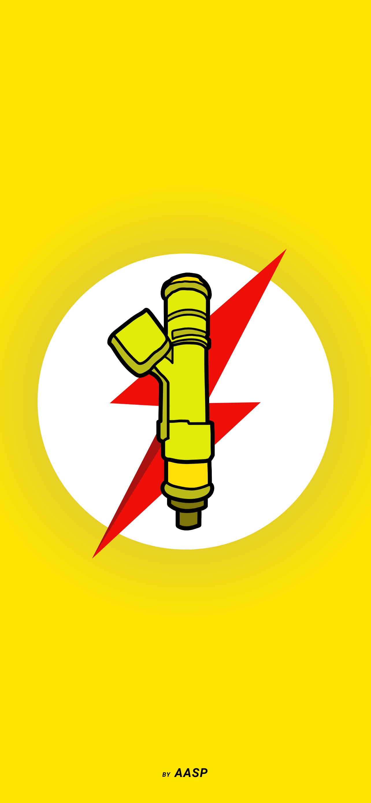

# FialhoCarApp 📱

## App desenvolvido para o usuario salvar a placa e uma foto correspondente ao painel do veículo, onde encontra-se informações sobre o nível de combustível no tanque.
⛽🚗
### Usuario relatou ser acusado de desviar combustível dos automóveis de seus clientes. Com esse aplicativo o usuário tem o controle da informação do nível de combustível quando o veículo é recebido pelo proprietario da Oficina Mecânica e obter a foto do painel e marcadores, resolvendo o problema. 

### Faça o [DOWNLOAD](LinkAQUI)

  

